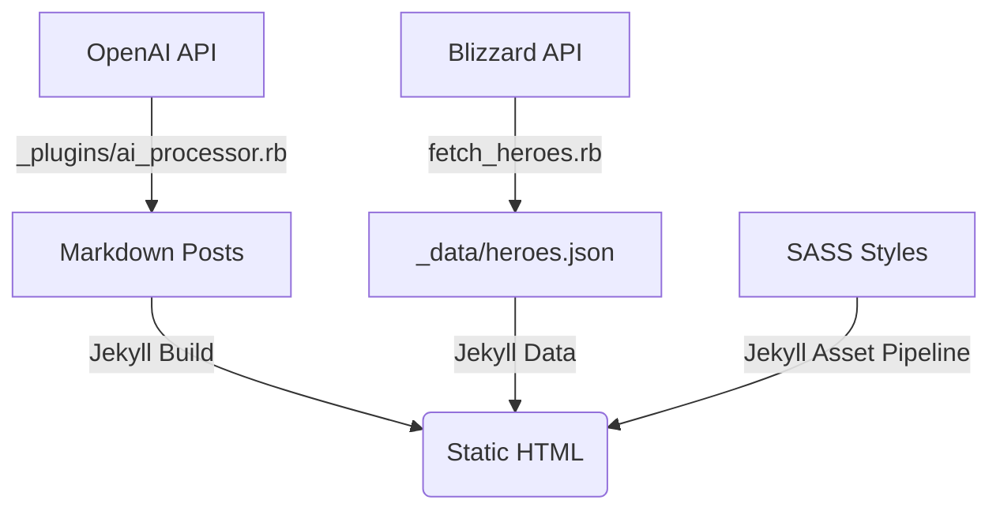

# System Architecture

## Overview
This project is a **Jekyll-based Static Site Generator (SSG)** enhanced with:
1.  **AI Processing**: Automated content summarization using OpenAI.
2.  **External Data Integration**: Dynamic data fetching from Blizzard's Battlegrounds API.

## Component Diagram

## Core Components

### 1. CMS Core (Jekyll)
- **Engine**: Jekyll 4.x
- **Language**: Ruby
- **Role**: Compiles Markdown content, Liquid templates, and SASS into static HTML/CSS.

### 2. AI Integration (`_plugins/ai_processor.rb`)
- **Trigger**: Runs during the `jekyll build` process.
- **Logic**: 
    - Iterates through all posts.
    - Sends post content to OpenAI API (`gpt-3.5-turbo`).
    - Receives a ~50-word summary.
    - Injects summary into the post's front matter data as `summary`.
- **Dependency**: `ruby-openai` gem.

### 3. Data Pipeline
#### Battlegrounds Data
- **Scripts**: 
    - `fetch_heroes.rb`: Authenticates with Battle.net (OAuth2 Client Creds) and fetches hero data. 
    - Output: `_data/heroes.json`.
- **Usage**: Data in `_data` is accessible in Liquid templates via `site.data.heroes`.

### 4. Frontend Architecture
- **CSS**: Custom SCSS architecture located in `_sass/`.
- **JavaScript**: Minimal, mostly for UI interactions if any (currently static).
- **Theme**: "Navy Theme" (Deep blue/Navy color scheme).

## Directory Structure Strategy
- `_plugins/`: Ruby code that extends Jekyll's build process.
- `scripts/` (root *.rb): Standalone utilities for data maintenance.
- `_data/`: JSON datasets acting as a local "database".
